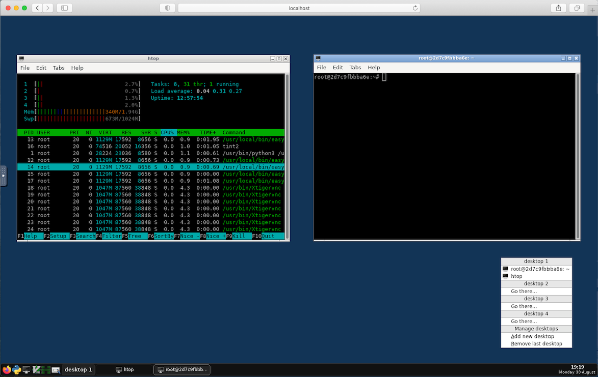

# novnc-desktop
A relatively small noVNC (web-based) desktop Docker image

## Features
* Ubuntu Focal Docker base image
* [easy-novnc](https://github.com/pgaskin/easy-novnc) - A Golang based noVNC binary
* [TigerVNC](https://tigervnc.org/) - supports auto screen resizing
* [Openbox](http://openbox.org/wiki/Main_Page) - A light weight window manager
* Firefox - Browser
* Includes basic utilities such as `ssh`, `curl` etc.
* Total image size - 732MB

This Dockerfile is derived from <a href="https://www.digitalocean.com/community/tutorials/how-to-remotely-access-gui-applications-using-docker-and-caddy-on-debian-9" target="_blank">how-to-remotely-access-gui-applications-using-docker-and-caddy-on-debian-9</a>

## Screenshots

<p align="center">
  
</p>

<p align="center">
  
</p>

## Build

```bash
git clone https://github.com/prbinu/novnc-desktop.git
cd novnc-desktop

docker build --squash -t prbinu/novnc-desktop -f Dockerfile .
```

### Run

```bash
docker run -p 8080:8080 -e "TZ=America/Los_Angeles" prbinu/novnc-desktop
```
In browser, open: `http://localhost:8080/
`
